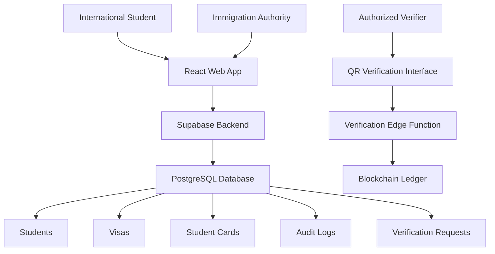

# IMS-IS — Immigration Management System for International Students


A secure, blockchain-integrated, machine-learning-ready platform for managing the registration, verification, and visa lifecycle of international students in Kazakhstan. Built as a full-stack academic prototype using React, Supabase, blockchain-style tamper-evident hashing, QR verification, and role-based access control.

> **Thesis context:** *Designing the System for Immigration Management in Kazakhstan Using Blockchain Technologies and Machine Learning Algorithms* — a final-year research project addressing manual visa verification, fragmented institutional data, lack of tamper-proof identity validation, and heavy reliance on physical documents.

---

## Repository layout

This repository contains two top-level folders plus the project license:

| Path | What it is |
|---|---|
| [`IMS-Immigration-System-main/`](IMS-Immigration-System-main) | **The actual application source code.** A Vite + React + TypeScript project. All development happens here. |
| [`IMS-Immigration-System/`](IMS-Immigration-System) | **A static production build** (output of `npm run build`) served from the repository root, formatted for GitHub Pages hosting (includes a `404.html` fallback for client-side routing and a `/IMS-Immigration-System/` base path). This folder is generated — don't hand-edit it. |
| [`LICENSE`](LICENSE) | MIT license for the project. |

If you want to run, modify, or understand the app, work inside `IMS-Immigration-System-main/`. The root-level `IMS-Immigration-System/` folder only exists so the compiled site can be published via GitHub Pages directly from `main`.

---

## Key features

**Digital student identity**
- Tamper-evident student identity records, hashed and checked against a simulated blockchain ledger
- Digital student ID card with an embedded QR code
- Privacy-preserving verification (only minimal data is ever returned to a verifier)

**Immigration & visa management**
- Full visa lifecycle tracking: registration → approval → renewal → expiry
- Visa renewal request workflow between institutions and the immigration authority
- Centralized immigration database view across all institutions

**Institutional integration**
- Universities/colleges register and manage their own international students
- Attendance tracking and compliance dashboards
- Institution-scoped data access (an institution can only see its own students)

**QR-based verification**
- Each digital ID embeds a signed, versioned verification token
- A verifier (e.g. police/border authority) scans the QR and gets an instant valid/invalid result
- Verification checks token signature/expiry, card status, visa status, and blockchain-ledger integrity in one pass

**ML-ready architecture**
- Data model and analytics summary tables are structured to support future fraud-detection and visa-expiry-prediction models

---

## Architecture



The React frontend talks to a Supabase backend (PostgreSQL + Auth + Row-Level Security). Two Supabase Edge Functions handle the security-sensitive parts of the QR flow: `mint-card-token` issues a signed JWT for a student card, and `verify-card` validates a scanned token end-to-end (signature, expiry, card/visa status, and ledger integrity) before returning a minimal, privacy-preserving result.

### Current demo backend note

The project originally ran against a live hosted Supabase project. That project's free tier paused itself from inactivity, so `src/lib/supabaseClient.ts` currently points at a self-contained **in-browser mock backend** (`src/lib/mockBackend/`) instead. It re-implements the same query-builder surface (`supabase.from(...).select()...`, `.auth`, `.rpc`, `.functions.invoke`) used throughout the app, so the rest of the codebase — and the real `supabase/setup.sql` schema and edge functions — are unaffected. Point `supabaseClient.ts` back at a real Supabase project (see [Installation](#installation--setup)) to use the real Postgres backend instead of the mock.

---

## Technology stack

**Frontend**
- React 19 + TypeScript, built with Vite
- Material UI (MUI) for components/theming
- TanStack Query for server-state/data fetching
- React Hook Form + Zod for form state and validation
- React Router for routing
- Recharts for analytics charts
- `qrcode` / `qrcode.react` for QR code generation

**Backend**
- Supabase: PostgreSQL, Auth, Row-Level Security
- Supabase Edge Functions (Deno) for the verification API (`mint-card-token`, `verify-card`), using `jose` for JWT signing/verification

**Security & integrity**
- JWT-based auth (Supabase Auth)
- Row-Level Security policies scoping data per role
- A simulated blockchain hash ledger (`blockchain_ledger` table) for tamper-evidence checks on student cards

---

## User roles & dashboards

Access is role-based, enforced via Supabase Auth + RLS. Each role gets its own dashboard (`src/pages/*Dashboard.tsx`, composed from tabs in `src/components/dashboard/`):

| Role | Dashboard | Capabilities |
|---|---|---|
| `IMMIGRATION` | Immigration Dashboard | System-wide overview, all students/institutions/visas, compliance table, verification log, analytics |
| `INSTITUTION` | Institution Dashboard | Register/manage their own students, attendance, visa renewal requests, visa alerts, messaging |
| `STUDENT` | Student Dashboard | View own profile, visa status, digital ID/documents, request renewal, messages |
| *Verifier (unauthenticated)* | `/verify` page | Scan/enter a card token and get an instant valid/invalid verification result |

New sign-ups without a profile row are routed to `/onboarding` to complete role/institution setup before reaching a dashboard (see `src/pages/Dashboard.tsx`).

---

## Data model

Defined in [`IMS-Immigration-System-main/supabase/setup.sql`](IMS-Immigration-System-main/supabase/setup.sql), the schema includes:

- `institutions` — universities/colleges/language schools
- `profiles` — 1:1 with `auth.users`, holds role + institution/student linkage
- `students` — student records owned by an institution
- `visas` — visa lifecycle records per student
- `attendance_records` — per-student attendance
- `verification_requests` — log of every QR verification attempt (valid or not)
- `audit_logs` — immutable system activity trail
- `student_cards` — digital ID card state, including token version and record hash
- `blockchain_ledger` — the tamper-evidence hash ledger checked during verification
- `analytics_summary` — precomputed stats for dashboard analytics
- `visa_renewal_requests` — renewal workflow between institutions and immigration
- `messages` — in-app messaging between roles

---

## QR verification workflow

1. A student's digital ID card embeds a signed token minted by the `mint-card-token` edge function.
2. A verifier scans the QR (or opens `/verify` with the token) and the `verify-card` edge function:
   - Verifies the JWT signature, audience, issuer, and expiry
   - Confirms the token version matches the card's current version (blocks reuse of superseded QR codes)
   - Checks the card is `ACTIVE`
   - Compares the card's stored hash against the latest `blockchain_ledger` entry for tamper-evidence
   - Logs the attempt to `verification_requests` regardless of outcome
3. The response returns only the minimal data needed (institution name, visa status/end date, student nationality) — never the full student record.

---

## Installation & setup

```bash
cd IMS-Immigration-System-main
npm install
```

Create a `.env` file (see `.gitignore` — already excluded from version control):

```env
VITE_SUPABASE_URL=your_supabase_url
VITE_SUPABASE_ANON_KEY=your_supabase_anon_key
```

> By default the app uses the in-browser mock backend regardless of `.env` (see [Current demo backend note](#current-demo-backend-note)). To use a real Supabase project, run `supabase/setup.sql` against it, deploy the two edge functions in `supabase/functions/`, and change `src/lib/supabaseClient.ts` to export a real `createClient(...)` instead of the mock.

Run the dev server:

```bash
npm run dev
```

Other scripts (run from `IMS-Immigration-System-main/`):

```bash
npm run build     # type-check + production build (outputs to dist/)
npm run preview   # preview the production build locally
npm run lint      # run ESLint
```

### Publishing the static build

`vite.config.ts` sets `base: '/IMS-Immigration-System/'` for production builds so the app resolves correctly when hosted at `https://<user>.github.io/IMS-Immigration-System/`. After `npm run build`, the contents of `IMS-Immigration-System-main/dist/` are what get copied into the root-level `IMS-Immigration-System/` folder for GitHub Pages.

---

## Evaluation & testing (prototype)

The system is designed to be exercised with simulated data covering student registration, the full visa lifecycle, QR verification (valid/invalid/expired), and fraud/tamper scenarios — measuring verification response time, data-integrity accuracy, RLS enforcement, and behavior under concurrent requests.

---

## Disclaimer

This is an academic research prototype. External integrations — national immigration databases, a production blockchain network, and biometric systems — are simulated, not live.

## License

MIT License — see [LICENSE](LICENSE).
